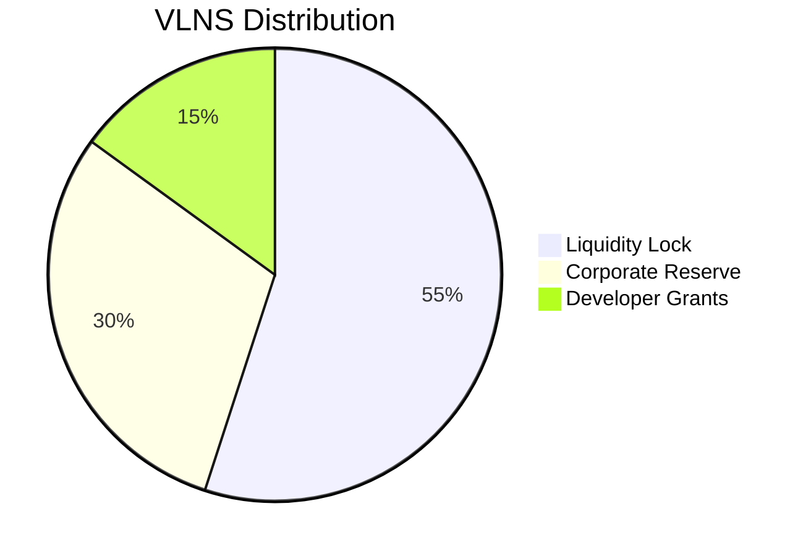

# Valens (VLNS) Whitepaper

  
*"Empowering software development through tokenized incentives."*

## Abstract  
Valens (VLNS) is an ERC-20 utility token issued by Valens d.o.o. (ID: 4202953090003), a Sarajevo-based software company. This fixed-supply token (1,000,000,000 VLNS) powers decentralized developer ecosystems on Ethereum.

### Corporate Details  
| Metric            | Value                          |  
|-------------------|--------------------------------|  
| Legal Entity      | Valens d.o.o.                  |  
| Registration ID   | 4202953090003                  |  
| Registered Address| Gradačačka 114, 71000 Sarajevo |  
| Jurisdiction      | Bosnia and Herzegovina         |  
| Technical Lead    | Branko Simić                   |  

### Token Specifications  
| Property          | Value                          |  
|-------------------|--------------------------------|  
| Contract Address  | 0x2c6DC67f9a424427d6fA8eDa454FAEed6bFe2b20 |  
| Type              | ERC-20 (Ethereum)              |  
| Total Supply      | 1,000,000,000 VLNS             |  
| Decimals          | 18                             |  

### Allocation  

## Key Features  
- *### Governance  
  - Snapshot voting (0.1% proposal threshold)  
  - Quarterly protocol upgrades  
- *### Developer Programs  
  - VLNS rewards per merged GitHub PR  
  - Audit bounty system  

## Compliance  
- **Scheduled Audit**: Q4 2025 by [TBD Auditor]  
- **Liquidity Lock**: Unicrypt until audit completion  

## Acquisition  
1. [Uniswap V3](https://app.uniswap.org/#/swap?inputCurrency=ETH&outputCurrency=0x2c6DC67f9a424427d6fA8eDa454FAEed6bFe2b20)  
2. Corporate developer grants  

## Legal  
> *"VLNS is a utility token issued by Valens d.o.o. (4202953090003). Subject to Bosnian law."*  

## Contact  
- **Legal Address**: Gradačačka 114, 71000 Sarajevo  
- **Email**: [info@valens.dev](mailto:info@valens.dev)  
- **Technical**: [brankosimic](https://github.com/brankosimic)  